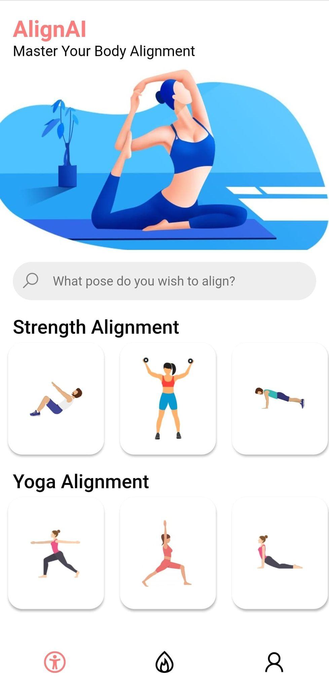
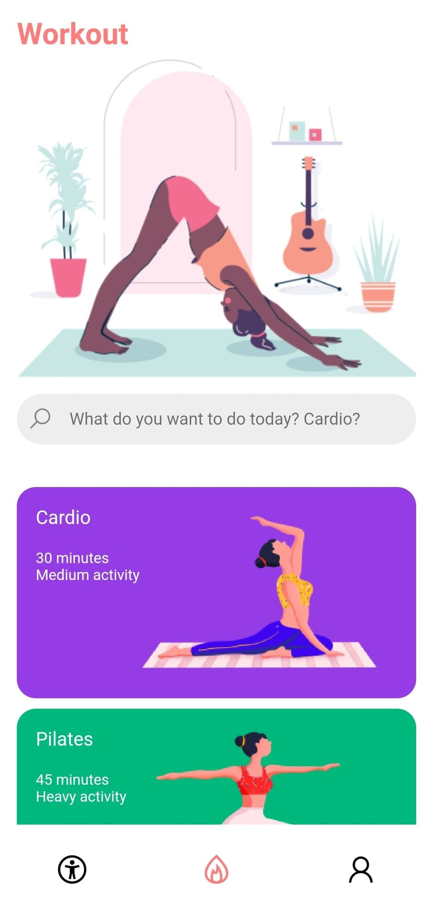

# Hack Western 7 - AlignAI

   

 

AlignAI is a mobile fitness application that utilizes TensorFLows pose estimation model to determine if a user is doing a specified exercise correctly based on their body alignment.

   

Since this was built in only 48 hours the code is certainly not perfect, but it works and I'll be improving it in the future! 
